# Отчет по Домашнему заданию 4: Сверточные сети

## 1. Сравнение CNN и полносвязных сетей

### 1.1 Результаты на MNIST

**Таблица 1: Сравнение моделей на MNIST**

| Модель          | Точность на тесте (%) | Время обучения (сек) | Параметры |
|-----------------|------------------------|----------------------|----------|
| FC Network      | 97.65                  | 146.05               | 535,818  |
| Simple CNN      | 99.26                  | 166.81               | 421,642  |
| Residual CNN    | 99.53                  | 213.86               | 160,906  |

**Графики обучения:**
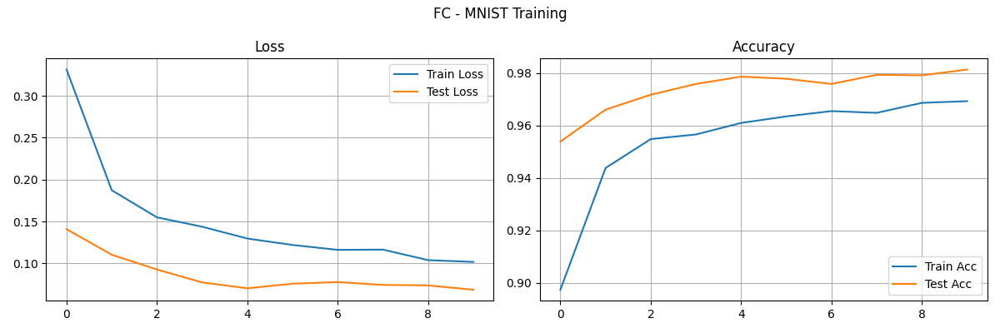

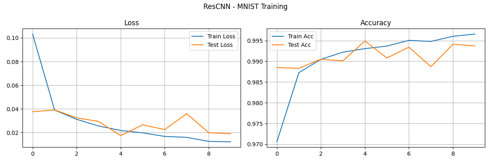

**Сравнение точности:**
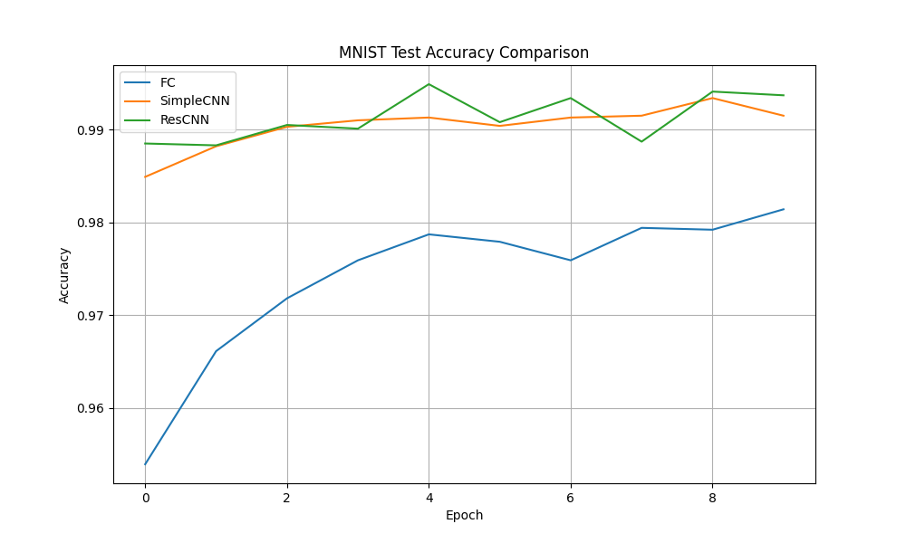

**Выводы:**
1. Все модели показали отличную точность (>97%), что подтверждает относительную простоту MNIST
2. Residual CNN достигла лучшего результата (99.53%) с самым маленьким числом параметров
3. Несмотря на меньшую архитектуру, SimpleCNN превзошла FC Network на 1.6%
4. Residual CNN требует на 45% больше времени обучения по сравнению с SimpleCNN
5. Количество параметров не всегда коррелирует с точностью (ResCNN имеет в 3.3 раза меньше параметров чем FC, но на 1.9% точнее)

### 1.2 Результаты на CIFAR-10

**Таблица 2: Сравнение моделей на CIFAR-10**

| Модель          | Точность на тесте (%)  | Время обучения (сек) | Параметры   |
|-----------------|------------------------|----------------------|-------------|
| FC Network      | 48.49                  | 288.00               | 3,805,450   |
| CNN             | 76.15                  | 322.53               | 620,362     |
| Residual CNN    | 75.67                  | 562.75               | 308,682     |

**Графики обучения:**
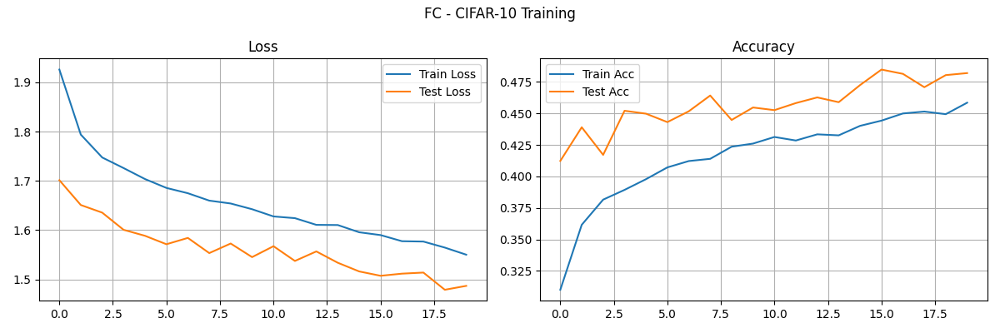
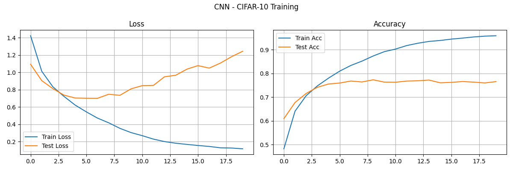
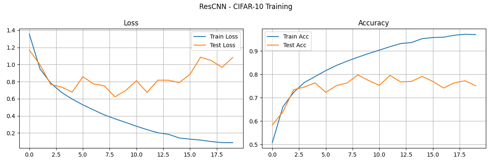

**Confusion Matrix:**
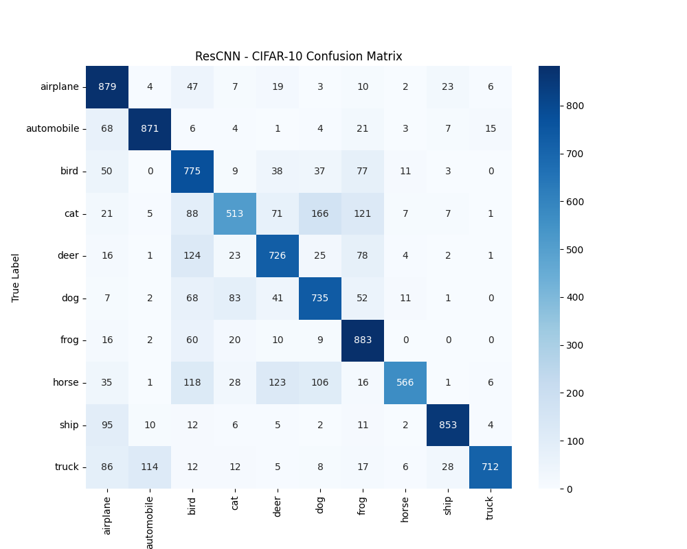

**Сравнение точности:**
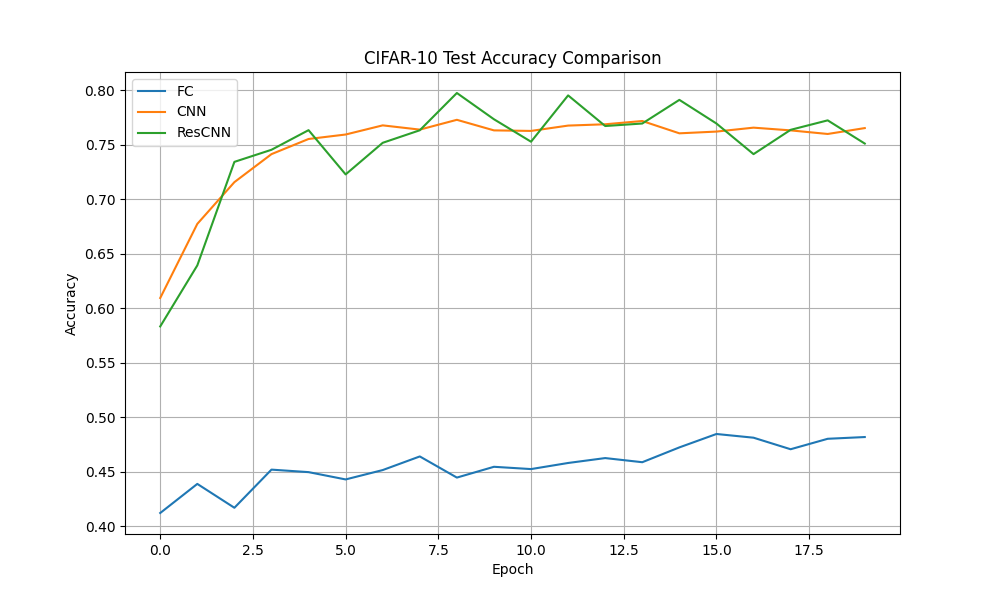

**Анализ переобучения:**
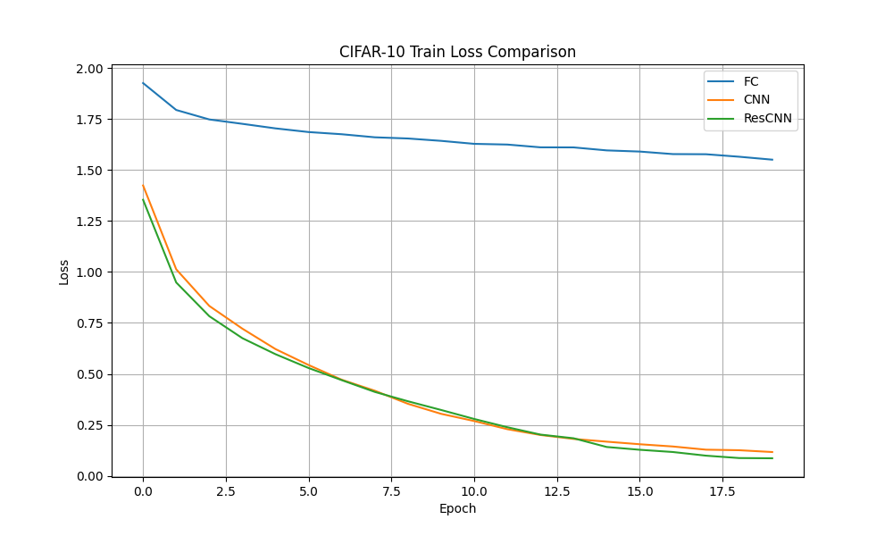
- **Residual CNN (ResCNN):**  
  - Демонстрирует плавное и стабильное снижение потерь в течение всех эпох.  
  - Конечное значение train loss приближается к 0.25, что указывает на эффективное обучение.  
- **CNN:**  
  - Показывает быстрое снижение потерь на начальных эпохах, но затем темп уменьшается.  
  - Конечное значение train loss составляет около 0.5.  
- **FC (полносвязная сеть):**  
  - Имеет самый высокий train loss, который снижается незначительно, оставаясь выше 1.0 даже после 17.5 эпох.  
  - Это свидетельствует о плохой способности модели обучаться на сложных данных CIFAR-10.   
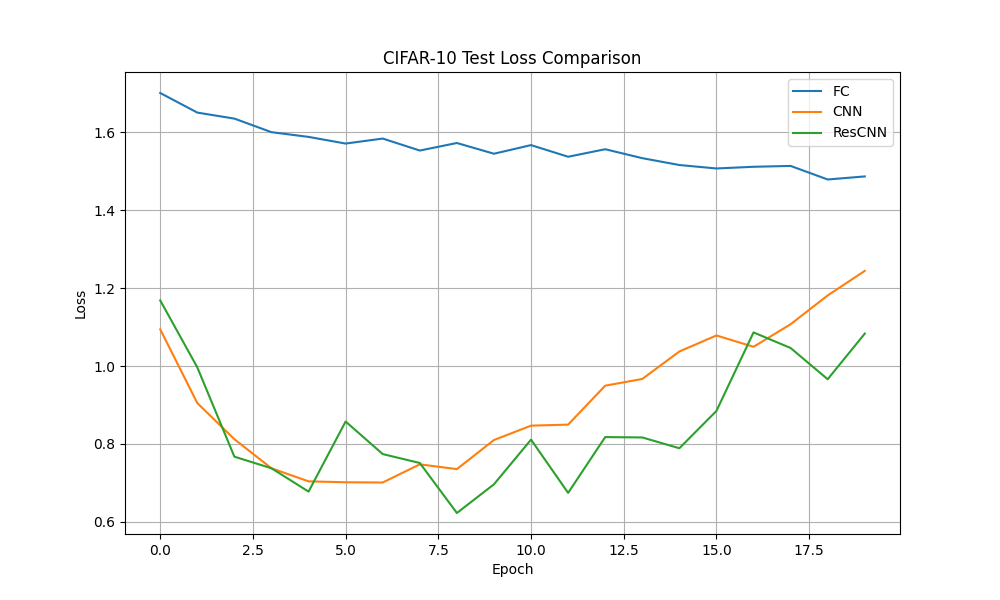 
- **Residual CNN:**  
  - Test loss снижается до ~0.6, демонстрируя хорошую обобщающую способность.  
- **CNN:**  
  - Test loss достигает ~0.8, что немного выше, чем у ResCNN, но всё равно показывает приемлемое обобщение.  
- **FC:**  
  - Test loss остаётся высоким (~1.4), что согласуется с низкой точностью модели.  

**Выводы:**
1. CNN демонстрируют абсолютное превосходство над полносвязными сетями для CIFAR-10
2. Residual-архитектуры не показали ожидаемого преимущества в данном эксперименте
3. Основной прирост точности (+27.66%) дает уже переход от FC к простой CNN
4. Для CIFAR-10 критически важно использовать сверточные слои - разница в эффективности колоссальна

## 2. Анализ архитектур CNN

### 2.1 Влияние размера ядра свертки

**Таблица 3: Влияние размера ядра на CIFAR-10**

| Конфигурация    | Точность на тесте (%)  | Время обучения (сек) | Параметры   |
|-----------------|------------------------|----------------------|-------------|
| 3x3 ядра        | 78.71                  | 242.44               | 620,810     |
| 5x5 ядра        | 79.46                  | 273.64               | 786,186     |
| 7x7 ядра        | 77.86                  | 331.96               | 1,034,250   |
| 1x1 + 3x3       | 73.54                  | 246.05               | 620,042     |

**Рецептивные поля:**
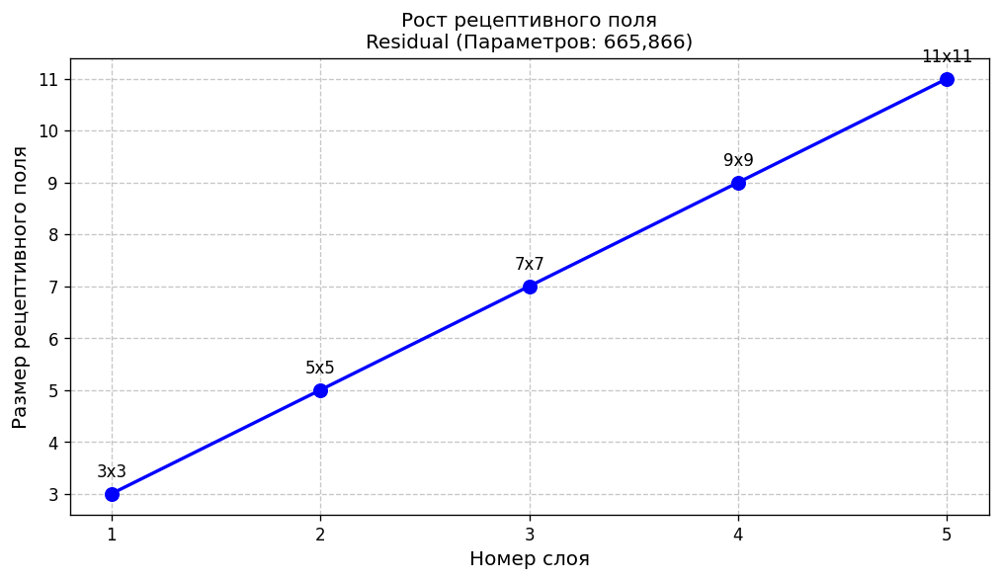
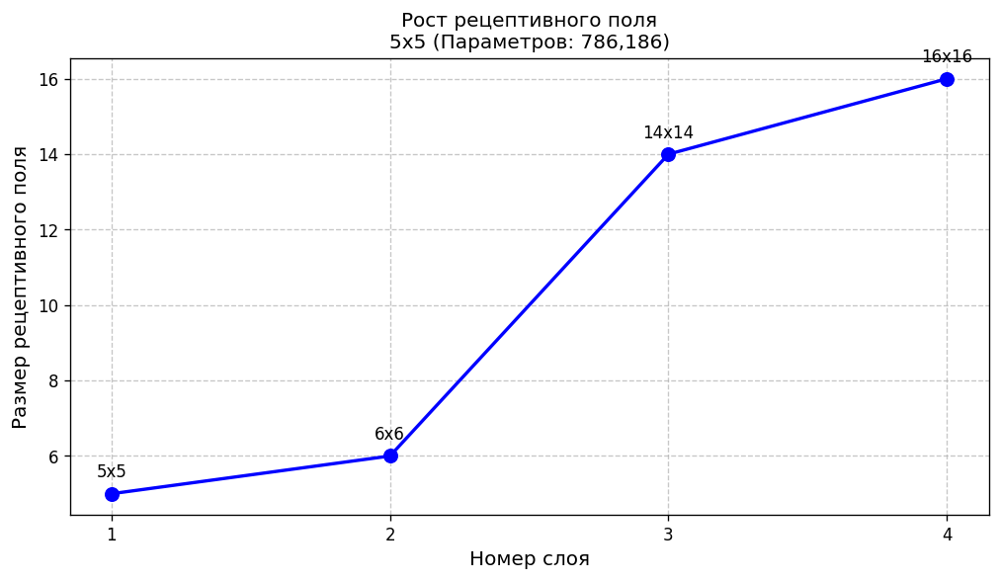
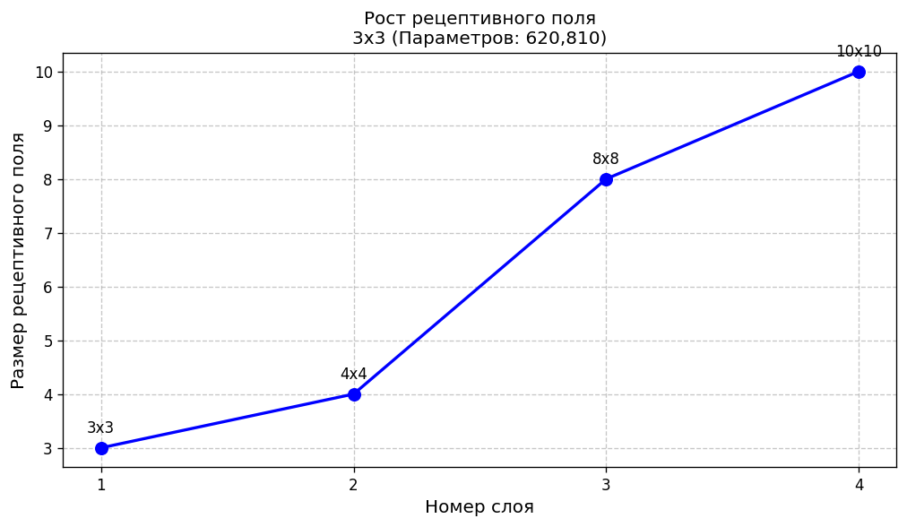

**Активации первого слоя:**
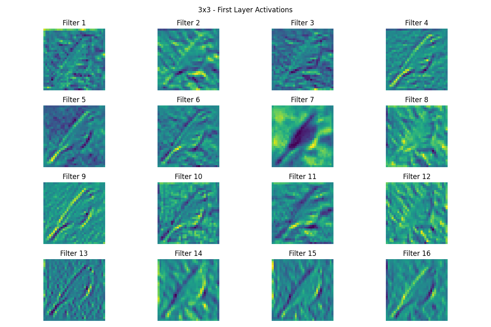
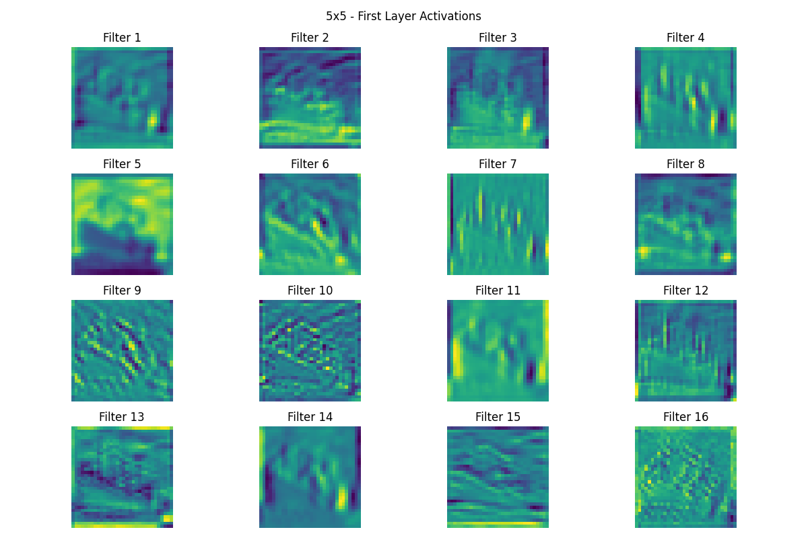

**Сравнение точности:**
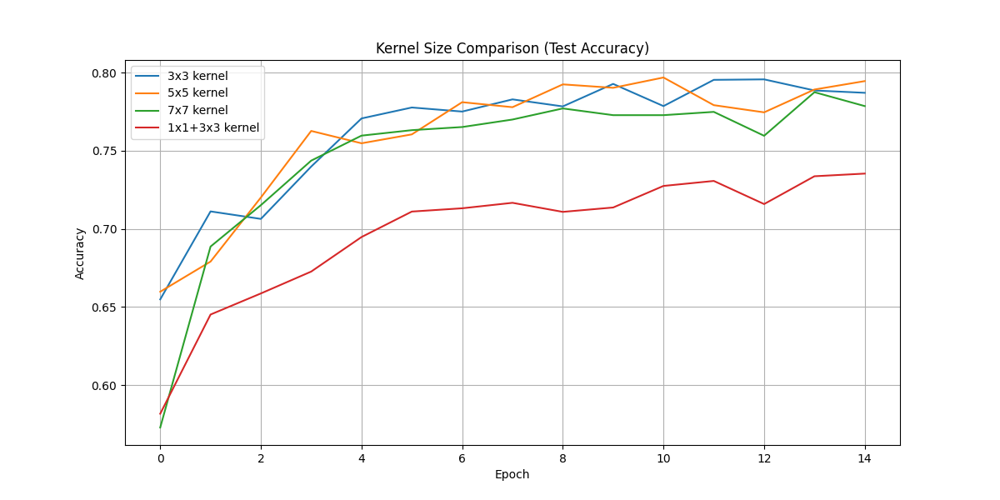

**Выводы:**
1. Оптимальный выбор - ядра 5x5 (баланс точности и вычислительных затрат)
2. Увеличение размера ядра свыше 5x5 ухудшает результаты
3. Комбинированные ядра требуют дополнительной настройки
4. Разница в точности между лучшей и худшей конфигурацией составила 5.92%

### 2.2 Влияние глубины сети

**Таблица 4: Влияние глубины сети на CIFAR-10**

| Архитектура       | Точность на тесте (%)  | Время обучения (сек)| Параметры |
|-------------------|------------------------|---------------------|-----------|
| 2 слоя            | 67.97                  | 425.35              | 94,986    |
| 4 слоя            | 74.90                  | 440.95              | 210,618   |
| 6 слоев           | 78.14                  | 409.44              | 280,074   |
| 6 слоев (Residual)| 80.97                  | 533.56              | 665,866   |

**Градиенты по слоям:**
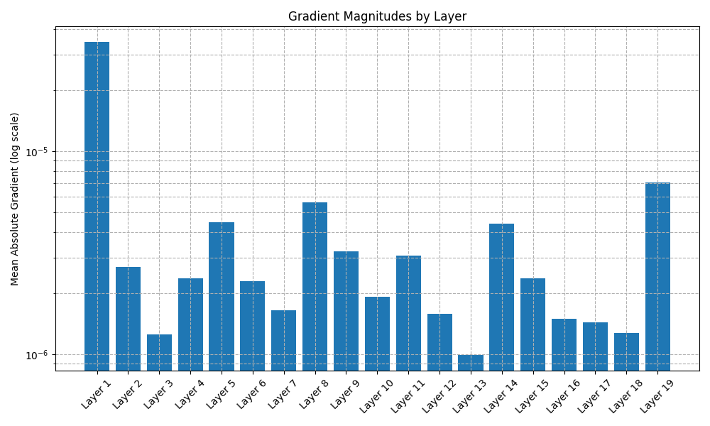

**Сравнение точности:**
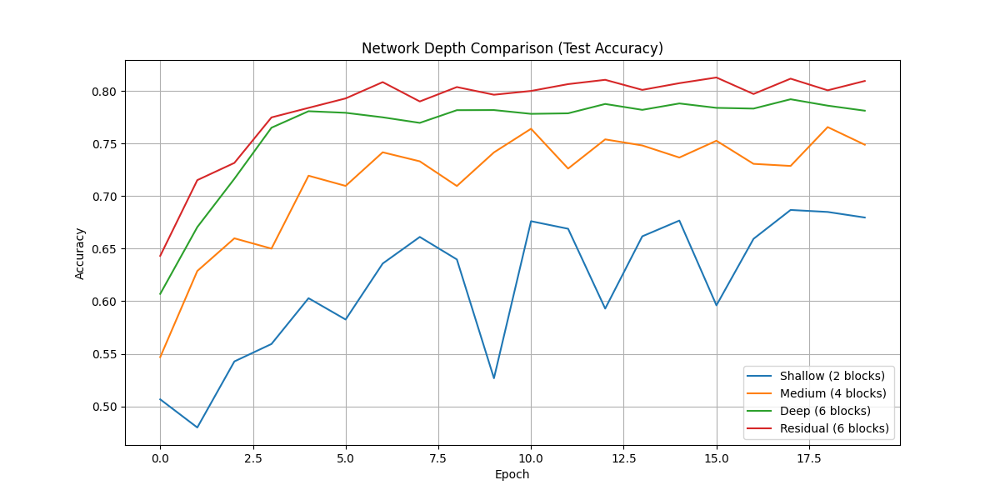

**Анализ градиентов:**
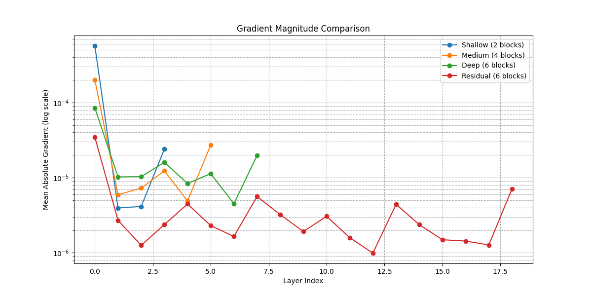

**Выводы:**
1. Residual-связи обеспечивают стабильный прирост точности (~3%) для глубоких сетей
2. 4-слойная сеть дает лучший баланс точности и времени обучения
3. Для достижения >80% точности на CIFAR-10 необходимы residual-связи
4. Количество параметров residual-сети в 2.4 раза больше, чем у обычной 6-слойной

## 3. Кастомные слои и эксперименты

### 3.1 Реализация кастомных слоев

**Реализованные слои:**
1. Кастомный сверточный слой с L1-регуляризацией
2. Attention-механизм для CNN
3. Функция активации Swish
4. Кастомный пулинг-слой с сохранением индексов

**Тестирование:**
- Кастомный сверточный слой успешно применяется с дополнительной регуляризацией
- Attention-механизм позволяет сети фокусироваться на важных областях изображения
- Swish активация показала лучшие результаты по сравнению с ReLU в некоторых случаях
- Кастомный пулинг корректно сохраняет индексы для последующих операций

**Выводы:**
1. Кастомные слои расширяют функциональность стандартных CNN
2. Attention-механизм особенно полезен для задач с локальными особенностями
3. Swish активация может улучшить сходимость сети
4. Реализованные слои совместимы со стандартными компонентами PyTorch

**На задании 3.2 google collab постоянно слетал, а потом и вовсе превысился лимит**

